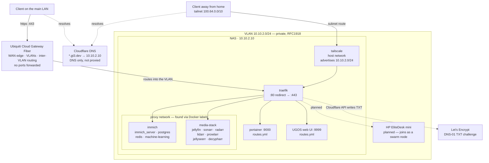

# Homelab

GitOps for my homelab. GitHub is the source of truth; Portainer on the NAS
deploys from this repo.

## Layout

```
stacks/             One directory per Portainer stack
  traefik/          Reverse proxy for *.gt3.dev
    docker-compose.yml      static config as command flags; creates the
                            proxy network and owns the docker provider
    dynamic/routes.yml      routes for things that aren't containers
  immich/
  media-stack/
  tailscale/        subnet router; state in a named volume
```

## Networking model

The NAS sits on its own VLAN, `10.10.2.0/24`, at `10.10.2.10`. That subnet is
why everything below is scoped the way it is.

`*.gt3.dev` is a wildcard A record on Cloudflare pointing at `10.10.2.10`,
grey-clouded so Cloudflare doesn't proxy it. Public DNS, private address: the
names resolve from anywhere, but only go somewhere useful from inside the
network. Nothing is port forwarded.

TLS is a Let's Encrypt wildcard for `*.gt3.dev` via the Cloudflare DNS-01
challenge. It validates with a TXT record, so nothing needs to be reachable
from outside for certificates to issue or renew.

### Network flow

Both address ranges below are private and unroutable from the internet:
`10.10.2.0/24` is RFC1918, `100.64.0.0/10` is the CGNAT space Tailscale uses.



### Getting to it from outside

Tailscale. The NAS advertises `10.10.2.0/24` as a subnet route (`TS_ROUTES` in
the tailscale stack), which puts the VLAN on the tailnet and makes the same
hostnames work away from home.

Two parts of that don't live in the compose file:

- `ip_forward` has to be enabled on the NAS, in `/etc/sysctl.d/99-tailscale.conf`
- the route has to be approved in the Tailscale admin console, under the
  machine's subnets

iOS and macOS pick up subnet routes on their own. Linux clients need
`--accept-routes`.

### Two providers

Traefik runs the Docker provider and the file provider together.

Containers opt in with `traefik.enable=true` and a few labels, on the shared
`proxy` network. Traefik reaches them over that network on their internal port,
so a labelled service needs no published host port at all. `exposedbydefault`
is off, so nothing is routed by accident.

The file provider covers what Docker can't see: the UGOS web UI, which isn't a
container, and portainer, which runs outside any stack.

This costs Traefik a `docker.sock` mount, which is worth naming plainly —
anything that compromises Traefik can talk to the daemon, and read access is
enough to enumerate everything. A socket-proxy sidecar would narrow that to the
endpoints Traefik actually needs.

## Adding a service

Most things are discovered from Docker labels. Traefik only watches containers
that opt in with `traefik.enable=true`, and only on the `proxy` network.

In the service's compose:

```yaml
  newthing:
    networks: [proxy]
    labels:
      - "traefik.enable=true"
      - "traefik.http.routers.newthing.rule=Host(`newthing.gt3.dev`)"
      - "traefik.http.routers.newthing.entrypoints=websecure"
      - "traefik.http.services.newthing.loadbalancer.server.port=8080"
```

and at the bottom of the file:

```yaml
networks:
  proxy:
    external: true
```

`server.port` is the port inside the container, not a published host port.
Traefik reaches it over the `proxy` network, so the service doesn't need a
`ports:` block at all unless you also want it reachable by IP.

Push, merge, then redeploy that stack. Traefik picks up the labels as the
container starts — no traefik redeploy needed.

Check it with `curl -sI https://newthing.gt3.dev | head -1`. A 404 means no
router matched, so the container either isn't on `proxy` or is missing
`traefik.enable=true`. The dashboard at `traefik.gt3.dev` lists what Traefik
currently sees.

### Things that aren't containers

The UGOS web UI and portainer can't be discovered, so they live in
`stacks/traefik/dynamic/routes.yml` as explicit routes:

```yaml
http:
  routers:
    newthing:
      rule: "Host(`newthing.gt3.dev`)"
      service: newthing
      entryPoints: [websecure]

  services:
    newthing:
      loadBalancer:
        servers:
          - url: "http://10.10.2.10:PORT"
```

That file is mounted into traefik, so changing it means redeploying the traefik
stack with "Re-pull image and redeploy" ticked.

Don't define the same hostname in both places. Two routers with the same rule
is ambiguous and which one wins isn't obvious.

No DNS or cert work either way. The `*.gt3.dev` wildcard covers every hostname
already.

### Force the recreate

Step 4 matters. Updating a git stack makes Portainer delete and re-clone the
repo directory on the host. Containers that aren't recreated stay pointed at
the old directory, so the mount goes empty and Traefik serves nothing -- still
running, no errors anywhere. Forcing the recreate remounts it.

https://docs.portainer.io/faqs/troubleshooting/stacks-deployments-and-updates/empty-relative-bind-mounts

### Where routes.yml comes from

Traefik mounts its dynamic config out of Portainer's git checkout, using the
host path:

```
/volume1/docker/portainer/compose/11/stacks/traefik/dynamic
```

Portainer clones to `/data/compose/<stackId>/` inside its own container. The
Docker daemon resolves bind mounts on the host, where that path doesn't exist,
so it creates an empty directory instead of failing. Portainer's `/data` comes
from `/volume1/docker/portainer`, so the path above is the same directory the
daemon can actually see.

The `11` is the stack id. Delete and recreate the traefik stack and it changes,
which breaks the mount the same silent way. If routing dies after a redeploy,
start here:

```
docker exec traefik ls /etc/traefik/dynamic    # should list routes.yml
```

Labelled services don't touch this path at all — it only matters for the
handful of routes still in `routes.yml`.

## Secrets

Secrets are **never** committed. Compose files reference `${VAR}`; the values
are set per-stack in Portainer's *Environment variables* section and stored on
the NAS.

See `.env.example` for which variables each stack requires. That file is
documentation only -- git-backed stacks in Portainer do not read it.

## Port 80/443 on the NAS

UGOS ships an nginx bound to `0.0.0.0:80` and `0.0.0.0:443` that exists only
to provide portless redirects to its web UI, which actually runs on 9999
(HTTP) and 9443 (HTTPS). Traefik cannot bind those ports until the redirects
are disabled:

> Control Panel → Device Connection → Portal settings → Web service
> uncheck **Redirect port 80 to HTTP port** and **Redirect port 443 to HTTPS
> port**, then Apply.

After that the NAS UI is reached at `:9999` / `:9443`, or through
`nas.gt3.dev` once Traefik is up.

## Static vs dynamic config

Static config (entrypoints, providers, ACME, the wildcard certificate) is set
as `command:` flags. Do not add a `traefik.yml` back -- Traefik's static config
sources are mutually exclusive, so the file would silently disable every flag.

Dynamic config comes from two places: Docker labels on the containers
themselves, and `dynamic/routes.yml` for the handful of things that aren't
containers. Traefik watches both and reloads on change.

## Conventions

- **State goes in a named volume**, not a bind mount. A relative bind mount
  resolves against whatever working directory the deploying tool picked, and
  Portainer's isn't the one you expect — Docker then creates an empty directory
  instead of failing, and the service starts with nothing. A named volume
  resolves by name and survives recreation as long as the stack keeps its name.
- **An absolute path is the alternative** where the data has to live somewhere
  specific, like `/volume1` media or immich's database.
- **Keep stack names stable.** Compose derives volume names from the project
  name, so renaming a stack orphans its volumes.
